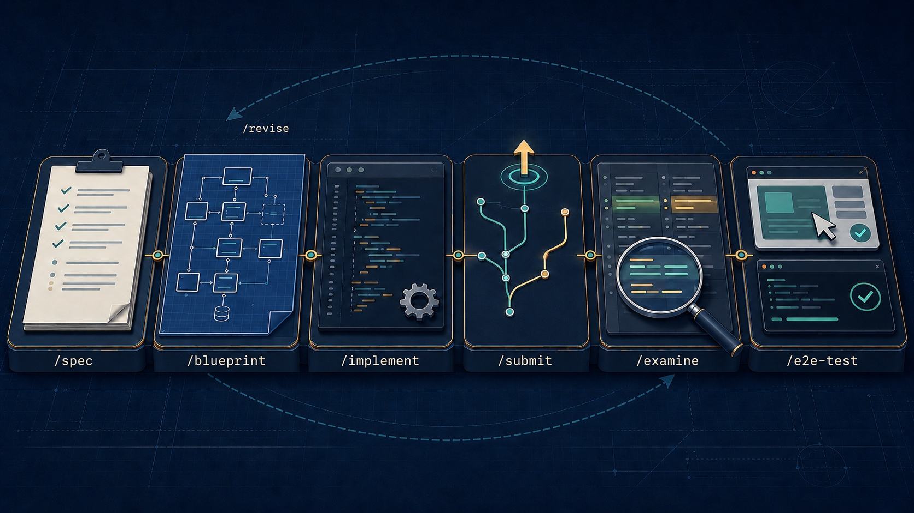

# swd — software development skills



A plugin of skills covering the full development cycle — spec, plan, build, submit, review, test — nine shipped, one planned. Runs on **Claude Code**, **Codex CLI**, and any [Agent Plugins](https://agent-plugins.org/) client.

| Skill | What it does | When it triggers |
| --- | --- | --- |
| **[/spec](./skills/spec)** | Turns a fuzzy feature request into a reviewable product spec — goals, non-goals, testable acceptance criteria with stable IDs, invariants — that later skills cite by path and ID. | "/spec", "spec this out", "write a product spec", "turn this idea into requirements". |
| **[/blueprint](./skills/blueprint)** | Validation-first planning: tests every load-bearing assumption against reality, cross-checks specs, architecture, and conventions, then delivers a plan a human can accept or reject from its first two sections. | "/blueprint", "blueprint this", "plan this thoroughly", "deep plan" — non-trivial changes where a wrong direction would burn meaningful time. |
| **[/rca](./skills/rca)** | Root-cause analysis: repro, timeline, evidence-backed 5-whys chain, sibling sweep, then two fix proposals (symptom vs cause) plus prevention for the whole class. | "/rca", "root cause", "5 whys", "why is this failing" — failures you want to learn from, not just patch. |
| **[/repo-docs](./skills/repo-docs)** | Bootstraps or extends `AGENTS.md` + `docs/` so coding agents find the project's real conventions instead of guessing. | "document the project for coding agents", "set up agent docs", "add AGENTS.md". |
| **[/rebase](./skills/rebase)** | Spec-aware rebasing: replays commits onto a new base while keeping the original intent, invariants, and conventions intact — not just resolving conflicts. | "rebase this branch on X", "move these commits onto the new base". |
| **[/submit](./skills/submit)** | Ships finished work as a reviewable draft PR: feature branch, well-formed Conventional Commits, pre-push checks, an honest what/why/how description, and CI gated green. | "/submit", "submit this", "open a PR", "create a pull request", "push this up". |
| **[/examine](./skills/examine)** | Production-risk-first holistic review of a PR, branch, or working tree; the host's built-in review is defect-first, this one also judges intent, approach, and right-sizing. | "/examine", "examine this PR", "review this PR", "review my branch", "check my PR before merge". |
| **[/revise](./skills/revise)** | Answers PR review feedback instead of obeying it: cross-validates every claim against code, design, and specs; verdicts each finding ACCEPT/PARTIAL/REJECT/DEFER with evidence; fixes accepted items at the root; replies where the feedback lives; re-submits. | "/revise", "address the review", "here's feedback on your PR", "respond to the reviewer". |
| **[/e2e-test](./skills/e2e-test)** | Tests the product the way its real user uses it — browser for a web app, binary for a CLI, consumer programs for a library — black-box from the change's blast radius, reporting PASS/FAILURE/BLOCKED per case, fixing nothing. | "/e2e-test", "e2e test this", "test it in the browser", "test it as the end user", "manual e2e testing". |
| **/implement** | Executes an approved blueprint plan with discipline: ordered steps, tests per step, deviations amend the plan instead of improvising. | Not implemented yet — [#27](https://github.com/korya/swd-skills/issues/27). |

Invocation differs per host: in Claude Code the skills fire on `/blueprint`, `/rca`, `/examine`, … (or on the natural-language triggers above); in Codex they are namespaced mentions — `$swd:spec`, `$swd:blueprint`, `$swd:rca`, `$swd:submit`, `$swd:revise`, `$swd:examine`, `$swd:e2e-test`, `$swd:rebase`, `$swd:repo-docs`.

## Install (from GitHub)

**Claude Code** — in the session:

```sh
/plugin marketplace add korya/swd-skills
/plugin install swd@swd
```

**Codex CLI** — in the shell (requires Codex ≥ 0.145):

```sh
codex plugin marketplace add korya/swd-skills
codex plugin add swd@swd
```

The first command points the host at `github.com/korya/swd-skills` as a marketplace. The second installs the `swd` plugin from that marketplace (`<plugin>@<marketplace>`).

The marketplace's internal name is `swd` (set in `.claude-plugin/marketplace.json`), which is why the install target is `swd@swd` even though the repo is `swd-skills`.

## Install (local checkout, for development)

```sh
git clone https://github.com/korya/swd-skills.git
```

**Claude Code:**

```sh
/plugin marketplace add /absolute/path/to/swd-skills
/plugin install swd@swd
```

After editing a skill, run `/reload-plugins` to pick up the changes.

**Codex CLI:**

```sh
codex plugin marketplace add /absolute/path/to/swd-skills
codex plugin add swd@swd
```

Codex copies the plugin into `~/.codex/plugins/cache/`, so edits to your checkout are *not* live. After editing a skill, re-run `codex plugin add swd@swd` to re-sync the copy, then start a new Codex session.

## Update

**Claude Code:**

```sh
/plugin marketplace update swd
```

**Codex CLI:**

```sh
codex plugin marketplace upgrade swd
```

This refreshes the Git snapshot *and* the installed copy under `~/.codex/plugins/cache/`. It only works for unpinned Git marketplaces — if you added the marketplace with `--ref <sha>`, `upgrade` fails; re-add it without the ref.

## Other hosts

The skills themselves are portable — `SKILL.md` with YAML frontmatter is read by OpenCode, pi, Grok Build, and Muse Code too. Only the *packaging* is host-specific: outside Claude Code and Codex there is no install command, so clone the repo and point your agent at `skills/`.

| Host | Reads |
| --- | --- |
| OpenCode | `.opencode/skills/`, `.claude/skills/`, `.agents/skills/` (and `~/` equivalents) |
| pi | `~/.pi/agent/skills/`, `~/.agents/skills/`, `.agents/skills/` |
| Muse Code | `~/.agents/skills/`, `.agents/skills/`; also `muse skills import --from claude` |
| Grok Build | `.claude/` skills, `AGENTS.md`, hooks, MCP |

`~/.agents/skills/` is the closest thing to a vendor-neutral location — symlinking `skills/*` there covers most of the table.

## Layout

```
plugin.json          # Agent Plugins 1.0.0 manifest (Codex + other AP clients)
.claude-plugin/
  marketplace.json   # marketplace manifest + plugin definition (Claude Code)
skills/
  <name>/
    SKILL.md         # core: under 8 KB, read whole by every host
    references/      # depth, read at the step that needs it
scripts/validate.py  # manifest + budget checks CI runs on every push
tests/               # unit tests for the validator
LICENSE              # AGPL-3.0-or-later
```

Two manifests, one package. Claude Code reads `marketplace.json` and ignores `plugin.json`; Codex resolves `plugin.json` first and validates its `$schema` strictly — a wrong value makes `codex plugin add` fail outright. CI runs both hosts' native validators to keep them honest, plus `scripts/validate.py` for the checks neither host makes (version agreement across manifests, marketplace ↔ `skills/` symmetry, skills naming no host-specific tool, and every `SKILL.md` inside Codex's prompt budget).

## Development

```sh
python3 scripts/validate.py
python3 -m unittest discover -s tests
```

The first command validates both manifests and every skill; the second runs the validator's own unit tests. CI runs both, plus each host's native validator.

Skill budgets: Codex loads at most **8,000 bytes** of a `SKILL.md` — raw file, frontmatter included — and silently drops the rest, and shortens descriptions past **1,024 characters** in the catalog ([#10](https://github.com/korya/swd-skills/issues/10)). The validator prints every skill's budget, warns from 90% of either limit, and fails the build past either cap. Keep the core a step skeleton and move depth into `references/` files the skill reads at the step that needs them.

Bump the version in **both** `plugin.json` and `.claude-plugin/marketplace.json` (`metadata.version` and the plugin entry). The validator fails if they disagree — Codex derives the installed version from `plugin.json`, so a stale value stalls updates for Codex users.
